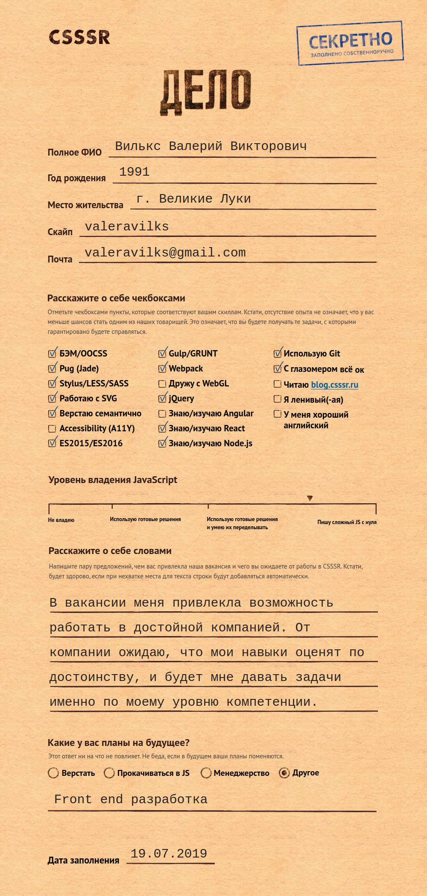

# Pixel Perfect layout for the job CSSSR.ru

You can see the result here (<a href="dist" target="_blank">click</a>)

This project was created in response to the test task of the employer.

The task was to produce pixel rect layout of the page. This page has many subtleties, irregularities that needed to be seen and made up correctly. This is from the jumping text to the lines that are rotated several degrees.



The following tools were used for the version of this layout:
* Html
* Css
* Js
* Webpack
* Scss
* Npm
* Jquery
* Smartgrid
* Pug

A letter from the employer after completing the assignment:
```
Thank you for solving the test task and interest in our team! We checked your test and you did a good job of it:
+ BEM good;
+ There is semantics, but it can be better (dilute the divs with sections, make labels with a label tag with reference to the input field);
+ Slider works;
+ Navigation from the keyboard is difficult, there is no highlighting of elements in focus;
+ The field "Tell us about yourself in words" increases with increasing number of lines;
+ PixelPerfect observed;
+ Adaptive not on all blocks;
+ Used html preprocessor (pug);
+ Used css preprocessor (stylus) with nesting, variables and mixins;
+ Intuitive project structure.
```
It should be noted that this work was done only for the desktop. I want to add from myself that in this work there are a lot of subtleties that are required for layout, and which are little needed in real projects, so for me this layout is indicative.


